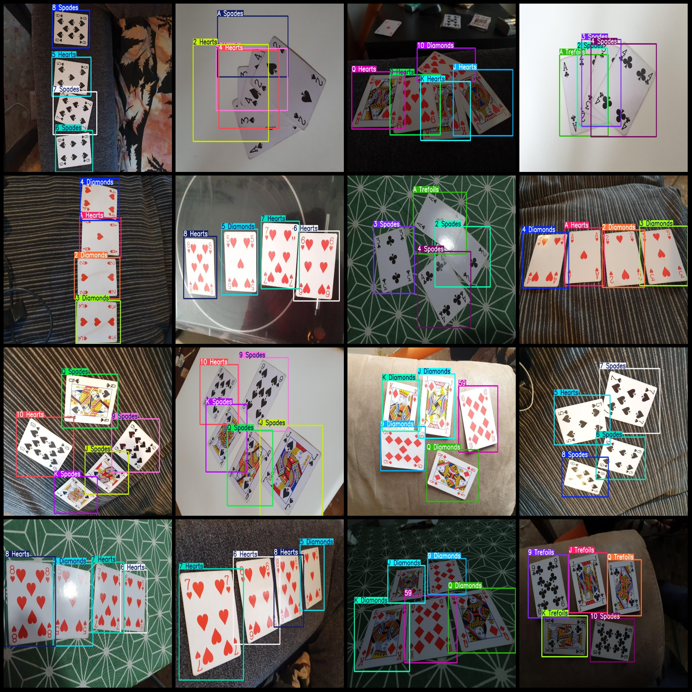
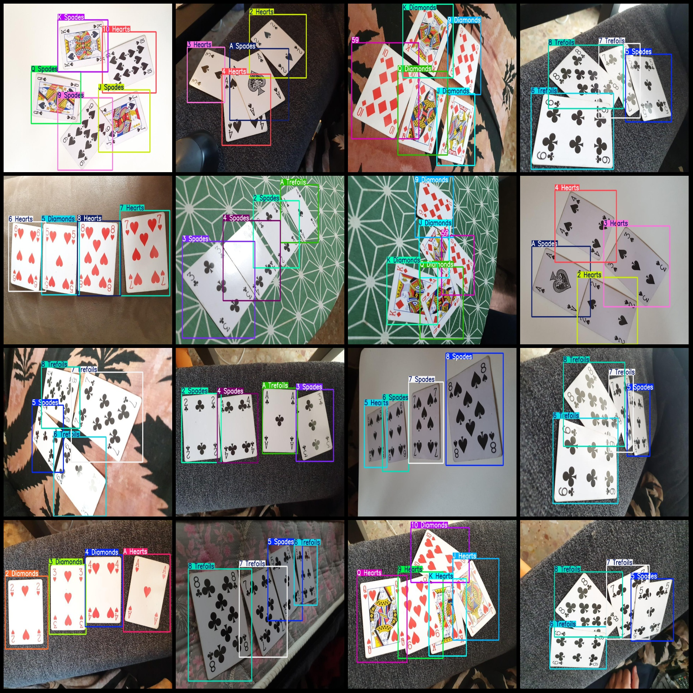

# Poker Detection Dataset VOC+YOLO format with 1285 cards of 53 categories

This dataset contains 1285 images, each labeled with 53 categories. These categories include "2 Diamonds", "2 Hearts", "2 Spades", "2 Trefoils", "3 Diamonds", "3 Hearts", "3 Spades", "3 Trefoils", "4 Diamonds", "4 Hearts", "4 Spades", "4 Trefoils", "5".
Diamonds", "5 Hearts", "5 Spades", "5 Trefoils", "6 Diamonds", "6 Hearts", "6 Spades", "6 Trefoils", "7 Diamonds", "7 Hearts", "7 Spades", "7 Trefoils", "8 Diamonds", "8 Hearts", "8 Spades", "8 
Trefoils", "9 Diamonds", "9 Hearts", "9 Spades", "9 Trefoils", "10 Diamonds", "10 Hearts", "10 Spades", "10 Trefoils", "59", and "A Diamonds", "A Hearts", "A Spades", "A Trefoils", "J Diamonds", "J"
Hearts", "J Spades", "J Trefoils", "K Diamonds", "K Hearts", "K Spades", "K Trefoils", "Q Diamonds", "Q Hearts", "Q Spades", "Q Trefoils"。

The number of boxes in each category is:
- 2 Diamonds: 113
- 2 Hearts: 100
- 2 Spades: 120
- 2 Trefoils: 104
- 3 Diamonds: 113
- 3 Hearts: 100
- 3 Spades: 120
- 3 Trefoils: 104
- 4 Diamonds: 113
- 4 Hearts: 100
- 4 Spades: 120
- 4 Trefoils: 100
- 5 Diamonds: 105
- 5 Hearts: 100
- 5 Spades: 108
- 5 Trefoils: 1
- 6 Diamonds: 100
- 6 Hearts: 105
- 6 Spades: 100
- 6 Trefoils: 108
- 7 Diamonds: 100
- 7 Hearts: 105
- 7 Spades: 100
- 7 Trefoils: 108
- 8 Diamonds: 100
- 8 Hearts: 105
- 8 Spades: 100
- 8 Trefoils: 108
- 9 Diamonds: 104
- 9 Hearts: 111
- 9 Spades: 100
- 9 Trefoils: 120
- 10 Diamonds: 111
- 10 Hearts: 100
- 10 Spades: 120
- 10 Trefoils: 104
- 59: 104
- A Diamonds: 104
- A Hearts: 113
- A Spades: 100
- A Trefoils: 120
- J Diamonds: 104
- J Hearts: 110
- J Spades: 100
- J Trefoils: 120
- K Diamonds: 104
- K Hearts: 111
- K Spades: 100
- K Trefoils: 120
- Q Diamonds: 104
- Q Hearts: 111
- Q Spades: 100
- Q Trefoils: 119

The dataset can be used for training and evaluation of image recognition models, especially for applications in poker card recognition.
## Images

Here is a pay link on Stripe ( https://buy.stripe.com/3cs8yP7sY87d0vu9AB ). Please contact me lonlonago@foxmail.com after funding $89, and I will send you a complete data files , thank you!

